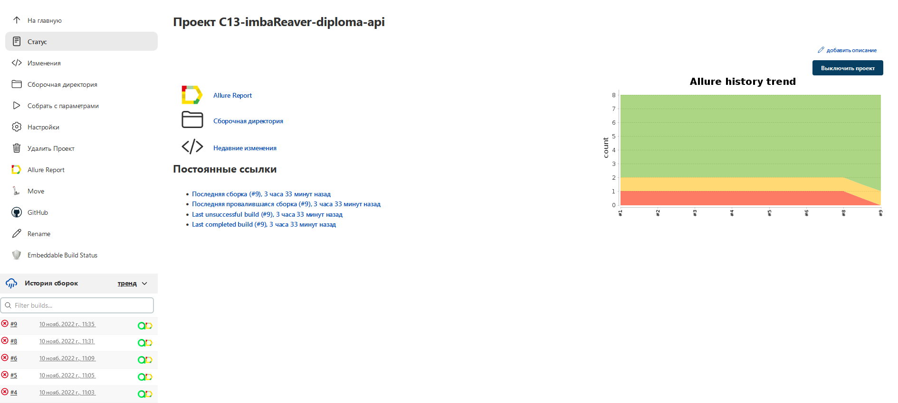
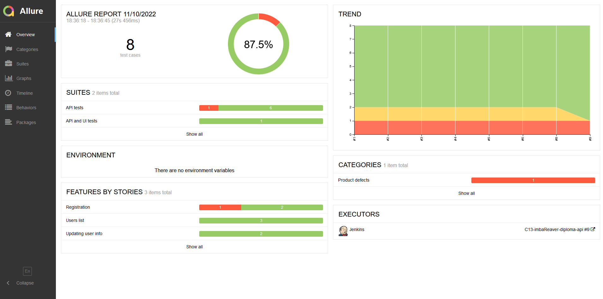
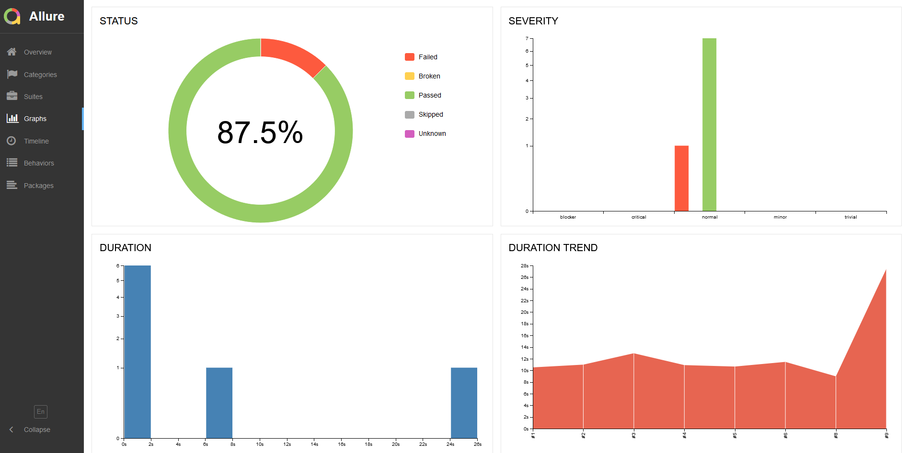
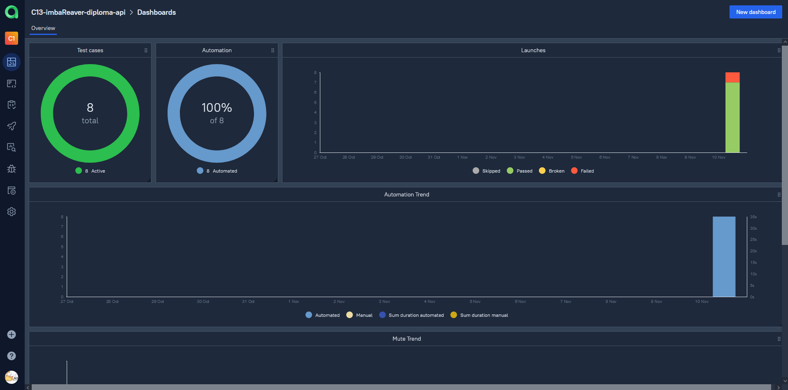
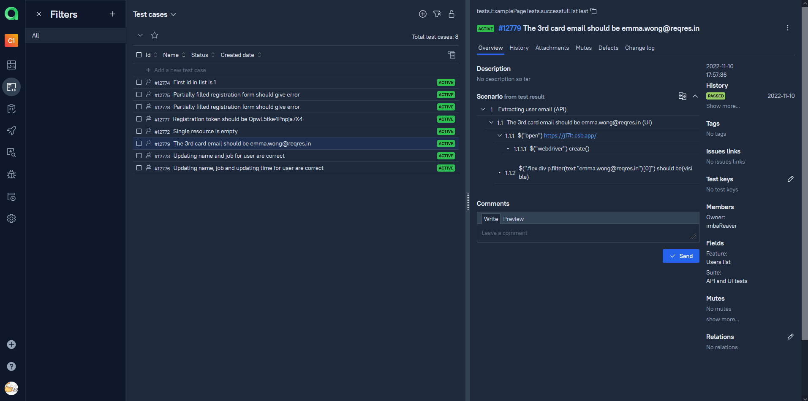
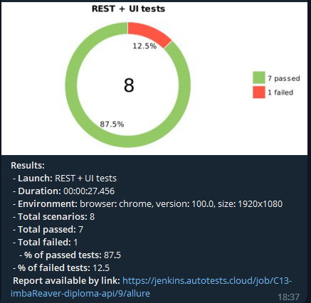

<h2 align="center"> Проект по автоматизации тестирования API для сайта сайта <a target="_blank" href="https://reqres.in/">reqres.in </a> </h2>

<a target="_blank" href="https://reqres.in/">
<p align="center">
  
</p></a>

## :green_book:	Содержание


> ➠ [Стек технологий](#classical_building-стек-технологий)
>
> ➠ [Реализованные проверки](#earth_africa-реализованные-проверки)
>
> ➠ [Запуск тестов из терминала](#запуск-тестов-из-терминала)
>
> ➠ [Запуск тестов из Jenkins](#запуск-тестов-из-jenkins)
>
> ➠ [Отчет о результатах тестирования в Allure Report](#skier-главная-страница-allure-отчета)
>
> ➠ [Интеграция с Allure TestOps](#интеграция-с-allure-testops)
> 
> ➠ [Уведомления в Telegram с использованием бота](#-уведомления-в-telegram-с-использованием-бота)
>
> ➠ [Пример запуска теста в Selenoid](#-пример-запуска-теста-в-selenoid)


## :classical_building: Стек технологий

<p align="center">


</p>

## :earth_africa: Реализованные проверки


### API

- [x] Проверка успешной регистрации
- [x] Проверка регистрации с отсутствующим паролем
- [x] Проверка обновления информации о пользователе
- [x] Проверка id пользователя в массиве
- [x] Проверка пустого ресурса
### API + UI
- [x] Парсинг email пользователя с API и проверка, что на сайте отображен этот email

## Запуск тестов из терминала

### :robot: Локальный запуск тестов с файлом local.properties

```
gradle clean test 
-Dhost=local
```
### :robot: Локальный запуск тестов без файла local.properties

```
gradle clean test 
-Dhost=local
-Dbrowser=${BROWSER}
-DbrowserVersion=${BROWSER_VERSION}
-DbrowserSize=${BROWSER_SIZE}
-DwebUrl=${WEB_URL}
-DapiUrl=${API_URL}
```

### :robot: Удаленный запуск тестов с файлом remote.properties

```
gradle clean test
-Dhost=remote
```
### :robot: Удаленный запуск тестов без файла remote.properties

```
gradle clean test
-Dhost=remote
-Dbrowser=${BROWSER}
-DbrowserVersion=${BROWSER_VERSION}
-DbrowserSize=${BROWSER_SIZE}
-DremoteDriverUrl=https://user1:1234@${REMOTE_DRIVER_URL}/wd/hub/
-DvideoStorage=https://${REMOTE_DRIVER_URL}/video/
-Dthreads=${THREADS}
-DwebUrl=${WEB_URL}
-DapiUrl=${API_URL}
```
## Запуск тестов из Jenkins

### :robot: Параметры сборки

> <code>REMOTE_URL</code> – адрес удаленного сервера, на котором будут запускаться тесты.
>
> <code>BROWSER</code> – браузер, в котором будут выполняться тесты (_по умолчанию - <code>chrome</code>_).
>
> <code>BROWSER_VERSION</code> – версия браузера, в которой будут выполняться тесты (_по умолчанию - <code>100.0</code>_).
>
> <code>BROWSER_SIZE</code> – размер окна браузера, в котором будут выполняться тесты (_по умолчанию - <code>1920x1080</code>_).

<a target="_blank" href="https://jenkins.autotests.cloud/job/C13-imbaReaver-diploma-ui/">**Сборка в Jenkins**</a>

<p align="center">
  
</p>

## Отчет в Allure Report
### :skier: Главная страница Allure-отчета

<p align="center">

</p>

### :eye_speech_bubble: Тест-кейсы

<p align="center">

</p>


### :frog: Основной дашборд

<p align="center">

</p>

## Интеграция с Allure TestOps
<a target="_blank" href="https://allure.autotests.cloud/launch/16595/tree?treeId=0">**Проект в TestOps**</a>
### :skier: Дашборд Allure TestOps

<p align="center">

</p>

### :eye_speech_bubble: Тест-кейсы

<p align="center">

</p>


##  Уведомления в Telegram с использованием бота

> После завершения сборки специальный бот, созданный в <code>Telegram</code>, автоматически обрабатывает и отправляет сообщение с отчетом о прохождении тестов.

<p align="center">

</p>


